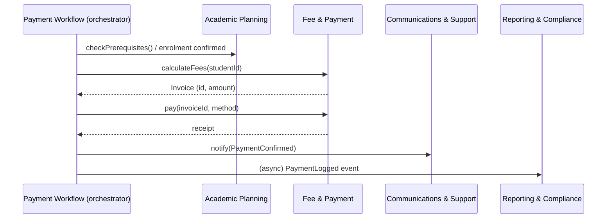

# Activity 2: Abstraction Design — Unified Digital Enrolment Platform

Built on the Activity 1 decomposition tree (`README.md`). This document turns those four
decomposition views into **modules with explicit boundaries**: what each module exposes,
what it hides, and how modules talk to each other.

## Design principle

The **functional decomposition** (F1–F8) becomes our module boundary — it's the one dimension
that groups a single cohesive purpose per unit. The other three views are folded in as internal
detail:

- **Object decomposition** → the domain objects living *inside* a module (data + behaviour kept
  together, never split apart).
- **Data decomposition** → each data category is **owned by exactly one module**; every other
  module reaches it only through that owner's interface, never directly.
- **Process decomposition** → workflows are **orchestrations across module interfaces**, not new
  modules of their own — a workflow never reaches into another module's internals to do its job.

## Module map: interface vs. hidden internals

| Module (from F1–F8) | Owns (data) | Contains (objects) | Exposes (public interface) | Hides (implementation) |
|---|---|---|---|---|
| **Identity & Onboarding** | Student Profile Data | `Student` | `register()`, `verifyDocuments()`, `getProfileSummary()` | Document storage format, verification vendor/algorithm, raw profile schema |
| **Academic Planning** | Course & Curriculum Data | `Course/Unit` | `browseCatalog()`, `checkPrerequisites()`, `enrol(studentId, courseId)` | Prerequisite graph structure, catalog storage, seat-counting logic |
| **Timetabling** | Timetable Data | `TimetableSession` | `generateTimetable()`, `getSchedule(studentId)`, `requestChange()` | Clash-detection algorithm, room-allocation heuristic, session storage |
| **Fee & Payment** | Financial Data | `Invoice` | `calculateFees()`, `pay(invoiceId, method)`, `void(invoiceId)` | Payment gateway integration, ledger/transaction storage, tax rules |
| **ID Issuance & Access Control** | Credential Data | `IDCredential` | `issueCredential(studentId)`, `activate()`, `revoke()` | Credential encoding, expiry computation, access-level mapping |
| **Communications & Support** | Communication Data | `SupportTicket` | `notify(event)`, `openTicket()`, `escalate()` | Message templating, delivery channel (email/SMS), ticket queueing |
| **Staff Operations** | (cross-cutting, staff-facing views) | — | `reviewException()`, `overrideDecision()` | Underlying module state each override touches |
| **Reporting & Compliance** | Compliance Data | — | `getAuditTrail()`, `generateReport()` | Raw event log format, analytics pipeline |

Rule of thumb applied everywhere: **the interface exposes intent, never state.** No module hands
out a raw struct/record for another module to mutate — e.g. `Invoice` exposes `pay()` and
`void()`, never `setStatus(...)`. That keeps business rules (a paid invoice can't be silently
reopened) inside the object that owns them.

## A process workflow, redrawn as interface calls only

Process decomposition's **Payment Workflow** (`calculate → process → generate receipt → log`)
crosses four modules. Drawn as an orchestration that only ever calls public interfaces:

Nothing here reaches into another module's data store. The orchestrator only knows each
module's public verbs — it has no idea *how* fees are calculated or *how* a receipt is stored.

## Defending against the common-mistakes checklist

1. **God object / god module** — avoided by keeping F1–F8 single-purpose. Fee & Payment does not
   also own credentials or notifications; Staff Operations only overrides, it doesn't own data.
2. **Leaky abstraction (exposing internal data structures)** — every cross-module call returns a
   domain object or DTO (`Invoice`, `TimetableSession`), never a raw DB row or internal map.
3. **Anemic domain model** — Object decomposition already paired data with behaviour
   (`Invoice: issue/pay/void`), so we kept that pairing instead of scattering "if paid then..."
   logic into the workflow layer.
4. **Direct cross-module data access ("reach-through")** — Reporting & Compliance does **not**
   query Financial Data or Credential Data tables directly; it consumes published events / calls
   read-only interfaces. This is the one place teams most often cheat for a quick report.
5. **Exposing setters instead of intention-revealing operations** — no module exposes
   `setStatus()`/`setState()`; only verbs that encode a valid transition (`revoke()`, `void()`).
6. **Inconsistent granularity across the four views** — resolved explicitly above: functional =
   module boundary, object = internal class, data = ownership, process = orchestration. Nobody
   on the team accidentally treated "Communication Data" as its own service.
7. **Circular dependencies** — dependencies are one-directional: Timetabling *reads* Academic
   Planning's catalog interface; Academic Planning never calls back into Timetabling.
8. **Hidden temporal coupling** — the workflow diagram makes call order explicit at the
   orchestration layer, so ordering assumptions aren't buried inside a module.

## Mapping to evaluation criteria

| Criterion | How this design satisfies it |
|---|---|
| **Cohesion** | Each module = one functional area, one owned data category, one object cluster. |
| **Coupling** | Modules interact only through narrow public interfaces or events; no shared mutable state. |
| **Information hiding** | Algorithms (clash detection, fee rules, credential encoding) and storage formats are named in the "hides" column and never appear in any interface signature. |
| **Encapsulation** | State-changing operations are intention-revealing verbs on the owning object, not external mutation. |
| **Interface clarity/minimality** | Each module's public surface is the smallest set of verbs needed by the workflows that use it (see interface column). |
| **Consistency across decomposition views** | Explicit rule set (above) shows how functional/object/data/process were reconciled instead of left contradictory. |
