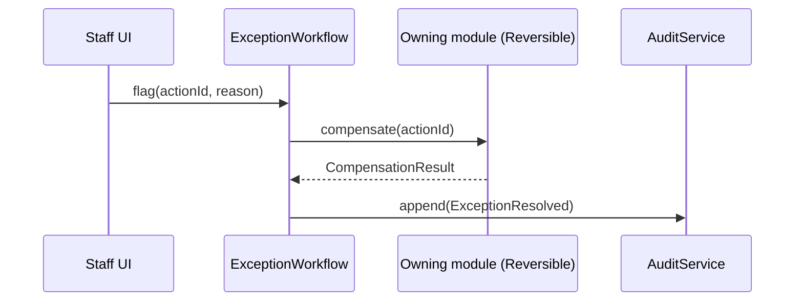
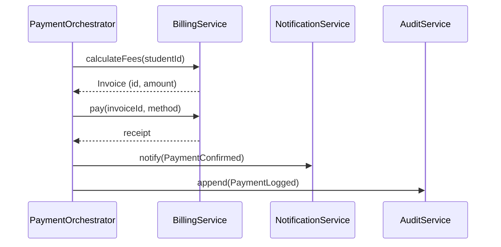

# Activity 2: Abstraction Design — Unified Digital Enrolment Platform

Built on the Activity 1 decomposition tree (`README.md`). This document turns those four
decomposition views into **modules with explicit boundaries**: what each module exposes,
what it hides, and how modules talk to each other.

**v3** — revised twice: v2 fixed three unnecessary abstractions, three modules doing two jobs
each, two leaking internal details, and two vague interfaces found by a critical design review.
v3 then ran the design against a five-criteria evaluation checklist (clarity, necessity,
coverage, single responsibility, modularity) and a five-item common-mistakes checklist, which
surfaced two more issues: `IdentityService` was still mixing two responsibilities, and
`ReportingService` had vague method names with unpinned read paths. Both are fixed below. See
[Changelog v1→v2](#changelog-v1--v2) and [Changelog v2→v3](#changelog-v2--v3) for the full
history. All tables reflect the current, fixed design.

## Design principle

The **functional decomposition** becomes our module boundary — it's the one dimension that
groups a single cohesive purpose per unit. The other three views are folded in as internal
detail:

- **Object decomposition** → the domain objects living *inside* a module (data + behaviour kept
  together, never split apart).
- **Data decomposition** → each data category is **owned by exactly one module**; every other
  module reaches it only through that owner's interface, never directly.
- **Process decomposition** → workflows are **orchestrations across module interfaces**, and are
  only promoted to their own orchestrator abstraction when they genuinely span ≥2 owning
  modules. A workflow contained entirely within one module's own data is just a method on that
  module, not a separate abstraction.

## Module map: interface vs. hidden internals

| Module | Owns (data) | Contains (objects) | Exposes (public interface) | Hides (implementation) |
|---|---|---|---|---|
| **Identity Records** (`IdentityService`) | Student Profile Data | `Student` | `register()`, `getProfileSummary()` | Raw profile schema, and the internal step of handing a new applicant to `DocumentVerificationService` before confirming registration |
| **Document Verification** (`DocumentVerificationService`) | Verification Data (uploaded docs, verification status) | — | `submitDocuments(studentId, docs)`, `verifyDocuments(studentId)` | Verification vendor/algorithm, document storage format — split out from Identity Records because KYC/document checking is a distinct job (often a third-party integration) from owning the student's profile record |
| **Academic Planning** (`AcademicPlanningService`) | Course & Curriculum Data | `Course` | `browseCatalog()`, `checkPrerequisites()`, `enrol(studentId, courseId)`, `getEnrolmentStats()` | Prerequisite graph structure, catalog storage, seat-counting logic, and the browse→select→check→confirm sequence (enrolment is internal to this module) |
| **Timetabling** (`TimetablingService`) | Timetable Data | `TimetableSession` | `generateTimetable()`, `getSchedule(studentId)`, `requestChange()` | Clash-detection algorithm, room-allocation heuristic, session storage, and *when/how often* generation runs (a scheduler just calls `generateTimetable()` — no separate "run" abstraction) |
| **Fee & Payment** (`BillingService`) | Financial Data | `Invoice` | `calculateFees()`, `pay(invoiceId, method)`, `void(invoiceId)`, `compensate(actionId)`, `getFinancialSummary()` | Payment gateway integration, ledger/transaction storage, tax rules, what "reversing" a specific charge actually requires |
| **Credential Issuance** (`CredentialIssuanceService`) | Credential Data | `IDCredential` | `issueCredential(studentId)`, `activate()`, `revoke()` | Credential encoding, expiry computation |
| **Access Control** (`AccessControlService`) | Access-level grants | — | `checkAccess(credentialId, resource)`, `grant()`, `compensate(actionId)` | Access-level mapping, per-resource permission rules — split out from issuance because it's an ongoing per-request decision, not a one-time lifecycle event |
| **Notifications** (`NotificationService`) | Notification Log | — | `notify(event: NotificationEvent)` | Message templating, delivery channel (email/SMS/push) — narrowed to a typed `NotificationEvent`, not an untyped blob |
| **Support** (`SupportTicketService`) | Ticket Store | `SupportTicket` | `openTicket()`, `assign()`, `escalate()`, `close()` | Ticket queueing/assignment logic — split out from Notifications; a help-desk queue and a broadcast alert are different jobs |
| **Audit** (`AuditService`) | Audit Log (raw, immutable) | — | `append(event)`, `query(filter)` | Append-only storage mechanism, retention policy — exposes only raw records, never aggregates |
| **Reporting** (`ReportingService`) | — (owns no data; reads only through the named methods below) | — | `generateComplianceReport()`, `generateEnrolmentDashboard()` | Aggregation/analytics pipeline — split out from Audit; regulatory retention and BI querying have opposite requirements. Its two methods pin down exactly what it reads: `generateComplianceReport()` calls only `AuditService.query()`; `generateEnrolmentDashboard()` calls only `AcademicPlanningService.getEnrolmentStats()` and `BillingService.getFinancialSummary()` — never a store directly. |

Rule of thumb applied everywhere: **the interface exposes intent, never state.** No module hands
out a raw struct/record for another module to mutate — e.g. `Invoice` exposes `pay()` and
`void()`, never `setStatus(...)`. That keeps business rules (a paid invoice can't be silently
reopened) inside the object that owns them.

## Domain objects (Object decomposition, narrowed)

| Object | Exposes | Fixed from v1 |
|---|---|---|
| `Student` | `register()`, `enrol()`, `getStatus()` | Removed `pay()` — paying is `Invoice`'s job, not `Student`'s; v1 had the same behaviour claimed by two objects. `register()` now delegates to `DocumentVerificationService` internally instead of `Student` or `IdentityService` owning verification logic. |
| `Course` | `updateDetails()` (instance-scoped) | Renamed from `updateCatalog()`, which was ambiguous about whether it updated one course or the whole catalog. Catalog-wide changes (add/deprecate a course) live on `AcademicPlanningService.publishCourse()`. |
| `TimetableSession` | `schedule()`, `cancel()` | Unchanged. |
| `Invoice` | `issue()`, `pay()`, `void()` | Unchanged. |
| `IDCredential` | `activate()`, `revoke()`, `isValid()` | Unchanged. |
| `SupportTicket` | `assign()`, `escalate()`, `close()` | Now backed by `SupportTicketService`, not `NotificationService`. |

## Cross-module workflows that survive as real orchestrators

Only two process-decomposition items actually coordinate across module boundaries with real
compensation/retry logic, so only these two remain as standalone orchestrator abstractions:

- **`PaymentOrchestrator`** — coordinates Billing → Notification → Audit.
- **`IssuanceOrchestrator`** — coordinates Identity Records (capture) → Document Verification
  (validate) → Credential Issuance (generate) → Access Control (provision). The Identity split
  makes this mapping exact: "capture → validate → generate → provision" is now four distinct
  module calls instead of two steps conflated inside one module.

**`ExceptionWorkflow`** replaces the old `StaffConsole` + `ExceptionOrchestrator` pair. In v1,
both hid "which downstream module's state an override touches" — meaning they had to know
another module's internals to do their job, which is a leak by definition. Fixed by giving every
module that can be compensated a uniform contract:

```
interface Reversible {
  compensate(actionId): CompensationResult
}
```

`BillingService`, `TimetablingService`, and `AccessControlService` implement it.
`ExceptionWorkflow` now only ever does:



It never inspects or mutates another module's internal state directly — it only knows the
`Reversible` contract, so the leak is closed. The Staff UI itself is not a domain abstraction; it's
a thin composition of `ExceptionWorkflow` plus each module's own admin-scoped operations (e.g.
`BillingService.void()`), so "Staff Operations" is no longer a fake module pretending to own data
it doesn't.

## A process workflow, redrawn as interface calls only

**Payment Workflow** (`calculate → process → generate receipt → log`) crosses three modules.
Drawn as an orchestration that only ever calls public interfaces:



Nothing here reaches into another module's data store. The orchestrator only knows each
module's public verbs — it has no idea *how* fees are calculated or *how* a receipt is stored.

## Changelog: v1 → v2

Found by critical design review; fixed here.

**Deleted (unnecessary — duplicated a module's own job):**
- `TimetableRunOrchestrator` — duplicated `TimetablingService.generateTimetable()`; scheduling is infra, not a domain abstraction.
- `RegistrationOrchestrator` — never actually left `IdentityService`; folded in as an internal method sequence.
- `EnrolmentOrchestrator` — never actually left `AcademicPlanningService`; also collided with `AcademicPlanningService.enrol()` on the same verb.

**Split (was doing two jobs):**
- `NotificationService` → `NotificationService` (broadcast) + `SupportTicketService` (ticket lifecycle).
- `CredentialService` → `CredentialIssuanceService` (one-time lifecycle) + `AccessControlService` (ongoing per-request checks).
- `ComplianceService` → `AuditService` (immutable raw trail) + `ReportingService` (aggregation/BI).

**Fixed (leaking internals):**
- `StaffConsole` / `ExceptionOrchestrator` → merged into `ExceptionWorkflow`, which now only calls a shared `Reversible.compensate()` contract instead of needing to know each module's private state.
- `AuditLog` → narrowed to expose only raw `append()`/`query()`; aggregation moved entirely to `ReportingService`.

**Fixed (vague):**
- `Course.updateCatalog()` → renamed `Course.updateDetails()` (instance-scoped); catalog-wide ops moved to `AcademicPlanningService.publishCourse()`.
- `NotificationService.notify(event)` → `event` is now a typed `NotificationEvent`, not an untyped blob.
- `Student.pay()` → removed; payment stays solely on `Invoice`/`BillingService`.

## Changelog: v2 → v3

Found by running the design against a five-criteria evaluation checklist (clarity, necessity,
coverage, single responsibility, modularity) and a five-item common-mistakes checklist
(over-fragmentation, under-decomposition, vague naming, mixed responsibilities, leaky
boundaries). Two genuine issues survived from v2; both are fixed here.

**Fixed (mixed responsibilities):**
- `IdentityService` was still doing two jobs — owning the student profile record *and*
  verifying uploaded documents (a KYC-style concern, often a distinct/third-party process). Split
  into `IdentityService` (profile record only) and `DocumentVerificationService` (document
  submission + verification only), each with its own owned data.

**Fixed (vague naming + unpinned read paths):**
- `ReportingService.generateReport()` / `getDashboard()` were generic names that didn't say
  *which* report — the same class of problem as `handleData()`. Renamed to
  `generateComplianceReport()` and `generateEnrolmentDashboard()`. Each method's exact read path
  is now pinned down in the module table (`AuditService.query()`; `AcademicPlanningService
  .getEnrolmentStats()` and `BillingService.getFinancialSummary()`) instead of the vague "reads
  from other services' read interfaces," closing the risk of a future reach-through into a store.

**Evaluated and kept as-is (defensible, not fixed):**
- `AuditService`/`ReportingService` and `CredentialIssuanceService`/`AccessControlService`
  remain split. Each split is justified by a concrete difference (retention/legal requirements
  vs. BI querying; one-time lifecycle vs. per-request decision), not fragmentation for its own
  sake — but this is flagged as the design's most arguable trade-off, worth being ready to
  defend rather than claiming it's beyond question.

## Evaluation checklist audit (v3)

| Evaluation criterion | Verdict |
|---|---|
| Clarity | ✅ Every interface uses an intention-revealing verb; no implementation-reading required to understand intent. |
| Necessity | ⚠️ Mostly justified; the Audit/Reporting and Issuance/AccessControl splits are defensible trade-offs, not free of debate. |
| Coverage | ✅ All four abstraction types present: interface (services + `Reversible`), data (owned stores + `NotificationEvent`), control (3 orchestrators), conceptual (6 domain objects). |
| Single responsibility | ✅ Fixed in v3 — `IdentityService`/`DocumentVerificationService` split closes the last known violation. |
| Modularity | ✅ Every module's implementation (gateway, vendor, delivery channel, encoding) is swappable behind an unchanged interface. |

| Common mistake | Verdict |
|---|---|
| Over-fragmentation | ⚠️ Acknowledged risk in the Audit/Reporting and Issuance/AccessControl splits; each is defensible on its own merits. |
| Under-decomposition | ✅ Not present — no remaining catch-all module. |
| Vague naming | ✅ Fixed in v3 — `ReportingService` methods renamed to name the specific report. |
| Mixed responsibilities | ✅ Fixed in v3 — `IdentityService` split. |
| Leaky boundaries | ✅ Fixed — `Reversible` contract, narrowed `AuditLog`, and `ReportingService`'s read paths are now named explicitly rather than implied. |

## Defending against the common-mistakes checklist

1. **God object / god module** — every module owns exactly one data category and one job; the
   v1 "Staff Operations" catch-all is gone, replaced by a thin UI composing real modules' own ops.
2. **Leaky abstraction (exposing internal data structures)** — every cross-module call returns a
   domain object or DTO (`Invoice`, `TimetableSession`), never a raw DB row or internal map; the
   one v1 leak (`ExceptionOrchestrator` needing another module's internals) is closed by the
   `Reversible` contract.
3. **Anemic domain model** — domain objects keep data and behaviour paired (`Invoice:
   issue/pay/void`), not scattered into workflow-layer conditionals.
4. **Direct cross-module data access ("reach-through")** — `ReportingService` never queries
   Financial or Credential tables directly; it reads through `AuditService`/each module's own
   read interfaces.
5. **Exposing setters instead of intention-revealing operations** — no module exposes
   `setStatus()`; only verbs that encode a valid transition (`revoke()`, `void()`).
6. **Doing two unrelated jobs under one name** — the three v1 modules that mixed two concerns
   (`NotificationService`, `CredentialService`, `ComplianceService`) are now split.
7. **Unnecessary abstraction duplicating an existing one** — the three v1 orchestrators that
   never crossed a module boundary are deleted; only genuinely cross-module workflows
   (`PaymentOrchestrator`, `IssuanceOrchestrator`, `ExceptionWorkflow`) remain as orchestrators.
8. **Circular dependencies** — dependencies are one-directional: Timetabling *reads* Academic
   Planning's catalog interface; Academic Planning never calls back into Timetabling.
9. **Hidden temporal coupling** — workflow diagrams make call order explicit at the orchestration
   layer, so ordering assumptions aren't buried inside a module.

## Mapping to evaluation criteria

| Criterion | How this design satisfies it |
|---|---|
| **Cohesion** | Each module = one job, one owned data category, one object cluster — enforced by splitting every module that mixed two concerns. |
| **Coupling** | Modules interact only through narrow public interfaces, typed events, or the shared `Reversible` contract; no shared mutable state. |
| **Information hiding** | Algorithms (clash detection, fee rules, credential encoding) and storage formats are named in the "hides" column and never appear in any interface signature. |
| **Encapsulation** | State-changing operations are intention-revealing verbs on the owning object, not external mutation. |
| **Interface clarity/minimality** | Every module's public surface is the smallest set of verbs its callers need; vague/untyped signatures (`notify(event)`, `updateCatalog()`) were tightened in v2. |
| **Consistency across decomposition views** | Explicit rule set (above) shows how functional/object/data/process were reconciled instead of left contradictory. |
| **No redundant abstractions** | Orchestrators exist only where a workflow genuinely spans ≥2 modules; three that didn't were deleted in v2. |
