# Week 2 Decomposition Activity

## Scenario: Unified Digital Enrolment Platform (University Scenario)

This activity decomposes a university's unified digital enrolment platform along four complementary dimensions: **functional**, **data**, **process**, and **object** decomposition.

```mermaid
graph TD
    ROOT["Unified Digital Enrolment Platform<br/>(University Scenario)"]

    ROOT --> FUNC["FUNCTIONAL<br/>DECOMPOSITION"]
    ROOT --> DATA["DATA<br/>DECOMPOSITION"]
    ROOT --> PROC["PROCESS<br/>DECOMPOSITION"]
    ROOT --> OBJ["OBJECT<br/>DECOMPOSITION"]

    FUNC --> F1["Student Onboarding &<br/>Identity Management"]
    FUNC --> F2["Course Selection &<br/>Academic Planning"]
    FUNC --> F3["Timetabling &<br/>Scheduling"]
    FUNC --> F4["Fee & Payment<br/>Management"]
    FUNC --> F5["ID Issuance &<br/>Access Control"]
    FUNC --> F6["Communications<br/>& Support"]
    FUNC --> F7["Staff Operations"]
    FUNC --> F8["Reporting &<br/>Compliance"]

    DATA --> D1["Student Profile Data<br/>(identity, documents)"]
    DATA --> D2["Course & Curriculum Data<br/>(catalog, prerequisite)"]
    DATA --> D3["Timetable Data<br/>(sessions, rooms, clashes)"]
    DATA --> D4["Financial Data<br/>(fees, transactions, invoices)"]
    DATA --> D5["Credential Data<br/>(ID numbers, access levels)"]
    DATA --> D6["Communication Data<br/>(alerts, tickets, logs)"]
    DATA --> D7["Compliance Data<br/>(audit trails, analytics)"]

    PROC --> P1["Registration Workflow<br/>apply → upload docs →<br/>verify → confirm"]
    PROC --> P2["Enrolment Workflow<br/>browse → select →<br/>check prereqs → confirm"]
    PROC --> P3["Timetable Generation<br/>allocate → detect clash →<br/>resolve → publish"]
    PROC --> P4["Payment Workflow<br/>calculate → process →<br/>generate receipt → log"]
    PROC --> P5["ID Issuance Workflow<br/>capture → validate →<br/>generate → provision"]
    PROC --> P6["Exception-Handling<br/>flag → review →<br/>override → log"]

    OBJ --> O1["Student<br/>data: profile, status<br/>behaviour: register, enrol, pay"]
    OBJ --> O2["Course/Unit<br/>data: code, catalog, update<br/>behaviour: open, close, update"]
    OBJ --> O3["Timetable Session<br/>data: time, room<br/>behaviour: schedule, cancel"]
    OBJ --> O4["Invoice<br/>data: amount, line items<br/>behaviour: issue, pay, void"]
    OBJ --> O5["ID Credential<br/>data: number, expiry<br/>behaviour: activate, revoke"]
    OBJ --> O6["Support Ticket<br/>data: subject, status<br/>behaviour: assign, escalate, close"]

    classDef func fill:#dbeafe,stroke:#3b82f6,color:#1e3a8a;
    classDef data fill:#dcfce7,stroke:#22c55e,color:#14532d;
    classDef proc fill:#ffedd5,stroke:#f97316,color:#7c2d12;
    classDef obj fill:#ede9fe,stroke:#8b5cf6,color:#4c1d95;

    class FUNC,F1,F2,F3,F4,F5,F6,F7,F8 func;
    class DATA,D1,D2,D3,D4,D5,D6,D7 data;
    class PROC,P1,P2,P3,P4,P5,P6 proc;
    class OBJ,O1,O2,O3,O4,O5,O6 obj;
```

## 1. Functional Decomposition

Breaks the platform down into the major functional areas it must support:

- Student Onboarding & Identity Management
- Course Selection & Academic Planning
- Timetabling & Scheduling
- Fee & Payment Management
- ID Issuance & Access Control
- Communications & Support
- Staff Operations
- Reporting & Compliance

## 2. Data Decomposition

Breaks the platform down into the major categories of data it manages:

- **Student Profile Data** — identity, documents
- **Course & Curriculum Data** — catalog, prerequisites
- **Timetable Data** — sessions, rooms, clashes
- **Financial Data** — fees, transactions, invoices
- **Credential Data** — ID numbers, access levels
- **Communication Data** — alerts, tickets, logs
- **Compliance Data** — audit trails, analytics

## 3. Process Decomposition

Breaks the platform down into the key end-to-end workflows, each shown as a sequence of steps:

- **Registration Workflow**: apply → upload docs → verify → confirm
- **Enrolment Workflow**: browse → select → check prereqs → confirm
- **Timetable Generation**: allocate → detect clash → resolve → publish
- **Payment Workflow**: calculate → process → generate receipt → log
- **ID Issuance Workflow**: capture → validate → generate → provision
- **Exception-Handling**: flag → review → override → log

## 4. Object Decomposition

Breaks the platform down into the key domain objects, each with its data and behaviour:

- **Student** — data: profile, status; behaviour: register, enrol, pay
- **Course/Unit** — data: code, catalog, update; behaviour: open, close, update
- **Timetable Session** — data: time, room; behaviour: schedule, cancel
- **Invoice** — data: amount, line items; behaviour: issue, pay, void
- **ID Credential** — data: number, expiry; behaviour: activate, revoke
- **Support Ticket** — data: subject, status; behaviour: assign, escalate, close
